# Manjaro Linux on Android
Install Manjaro on Android using Termux

## Get preinstalled xfce4 and vncserver Manjaro rootfs
Just download and proot into rootfs using Termux

View [manjaro-rootfs-arm64](https://github.com/krmanik/manjaro-fs-arm64)


## Note: Tigervnc 1.11.0 have issues running vncserver.
It is recommended to downgrade Tigervnc to 1.10.1. [View this for more](https://github.com/krmanik/Manjaro-Linux-on-Android/issues/5)


## Requirements
- Android device running arm64 architecture and minimum version of 7.0 Nougat.
- At least 5GB free storage space
- Termux
- A VNC viewer

## Quick Start
Copy this and paste it in termux and follow steps to install

```
pkg install -y wget proot pv pulseaudio && wget https://raw.githubusercontent.com/krmanik/Manjaro-Linux-on-Android/master/manjaro.sh && chmod +x manjaro.sh && ./manjaro.sh
```


## Install Manjaro cli only and install DE or WM manually

1. Install wget and get `manjaro.sh` script
    ```
    pkg install -y wget proot pv pulseaudio
    wget https://raw.githubusercontent.com/krmanik/Manjaro-Linux-on-Android/master/manjaro.sh
    chmod +x manjaro.sh
    ./manjaro.sh
    ```

    Note: Do not install `tigervnc` and desktop environment like `xfce4`, instead install it manually. 
    
    So, select `None` from Manjaro setup menu `None`, `xfce4`, `LxQt`, `Mate`, `i3`

2. Install DE or WM

    a) If want to use xfce4 then install it
    ```
    pacman -Sy xfce4
    ```
    b) If want to use openbox then install it
    ```
    pacman -Sy openbox
    ```

3. Install tigervnc
    ```
    wget https://raw.githubusercontent.com/AndronixApp/AndronixOrigin/master/Pacman/tigervnc-fix.sh
    chmod +x tigervnc-fix.sh
    ./tigervnc-fix.sh
    ```

    <details>
    <summary>View tigervnc-fix.sh</summary>

    ```
    pacman -S tar wget sed --noconfirm
    pacman -U https://raw.githubusercontent.com/AndronixApp/AndronixOrigin/master/tigervnc-1.10.1-1-aarch64.pkg.tar.xz --noconfirm
    curl -s https://raw.githubusercontent.com/AndronixApp/AndronixOrigin/master/lib.tar.xz -o /usr/lib/a.tar.xz && tar xf /usr/lib/a.tar.xz -C /usr/lib
    sed -i '27i IgnorePkg = tigervnc' /etc/pacman.conf
    ```

    </details>

4. Now run DE or WM

    a) DE
    ```
    vncserver
    export DISPLAY=:1
    startxfce4 &
    ```

    b) WM
    ```
    vncserver
    export DISPLAY=:1
    openbox &
    ```

    A laucher script can be created for running vncserver, export and xfce4 or openbox

5. Now customize as per requirements


## Demo

</img>

## Disclaimer

The software, code and website links available in this GitHub repo are provided "as is" without warranty of any kind, either express or implied. <br/>**Use at your own risk.**

# Steps to install Manjaro
1. Install [termux](https://play.google.com/store/apps/details?id=com.termux) and [RealVNC](https://play.google.com/store/apps/details?id=com.realvnc.viewer.android) from play store

| Termux | RealVNC |
|----------|:-------------:|
| 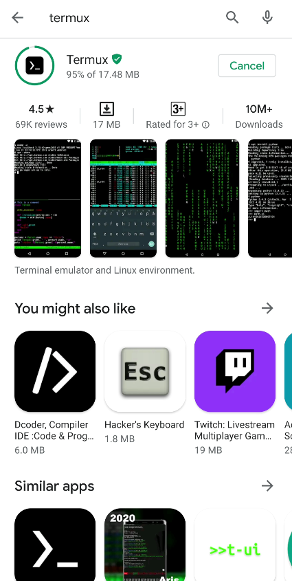</img> |  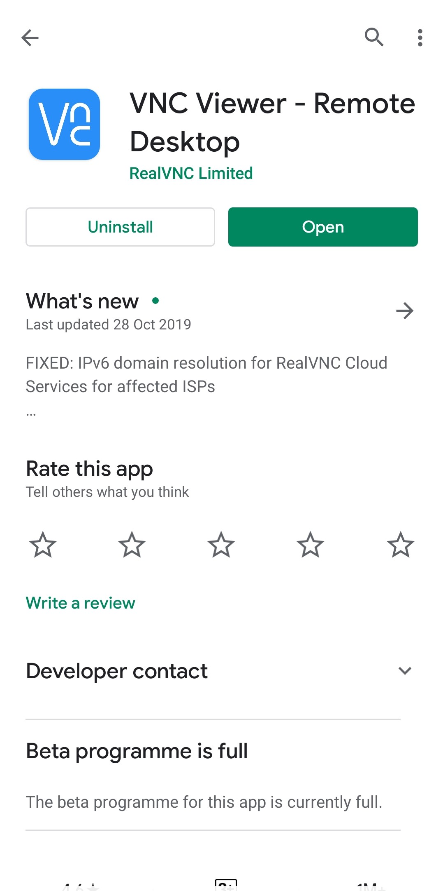</img> |

2. To install Manjaro, copy following and paste it in termux
```
pkg install wget && wget https://raw.githubusercontent.com/krmanik/Manjaro-Linux-on-Android/master/manjaro.sh && chmod +x manjaro.sh && ./manjaro.sh
```
</img>

3. It will install missing dependencies. (For audio)

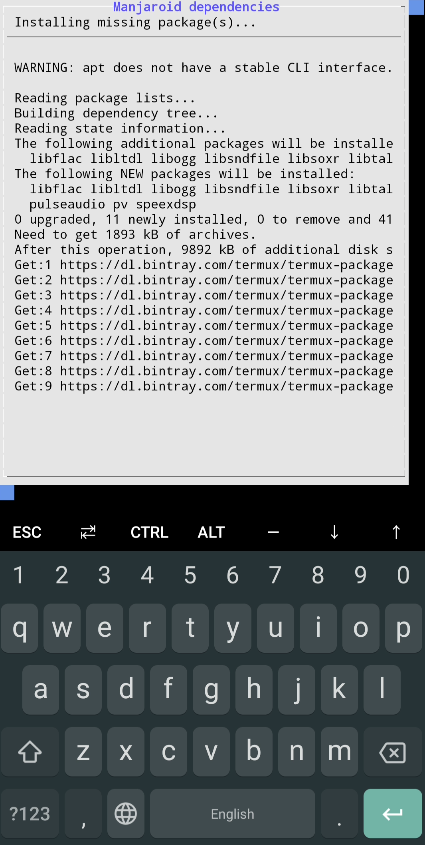</img>

4. Select "Install the latest rootfs"

</img>

5. Specify the installation directory

</img>

6. Wait for the first installation to finish

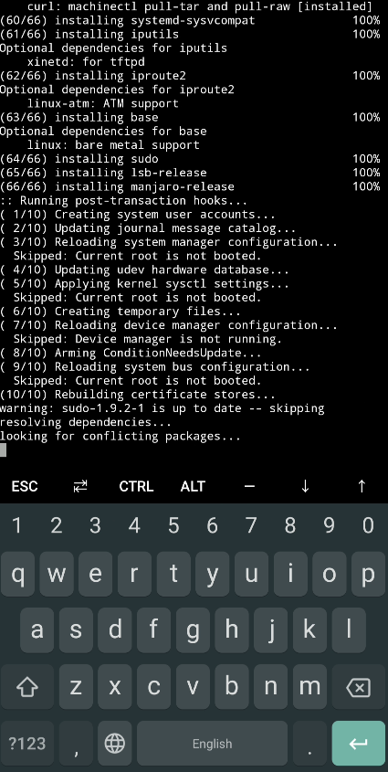</img>

7. Select desktop environment, select as per your requirements

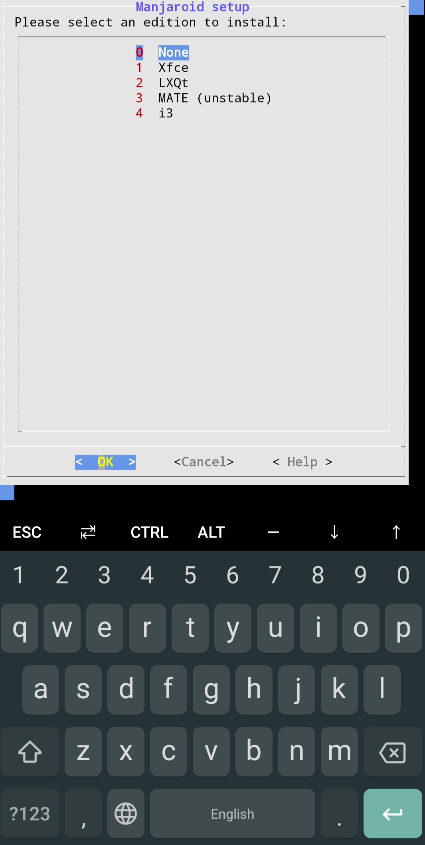</img>

**Size**

| xfce4   |      lxqt      |  
|----------|:-------------:|
| 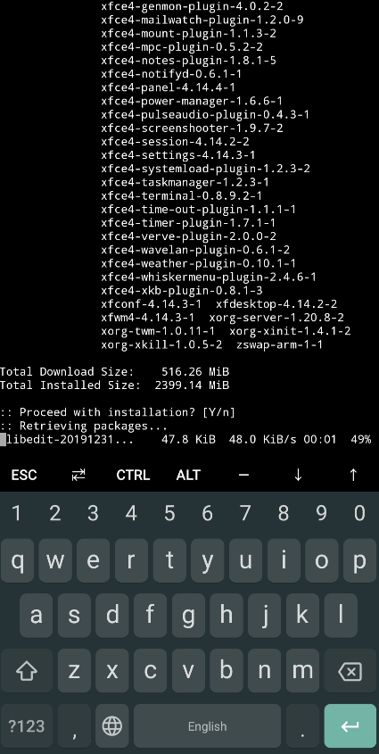</img> |  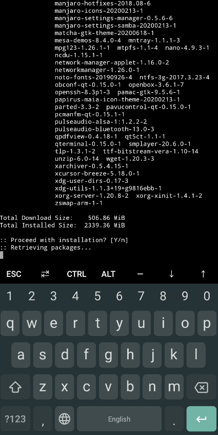</img> |

8. Select an username

 </img>  </img> 

9. Enter password for the username

</img> 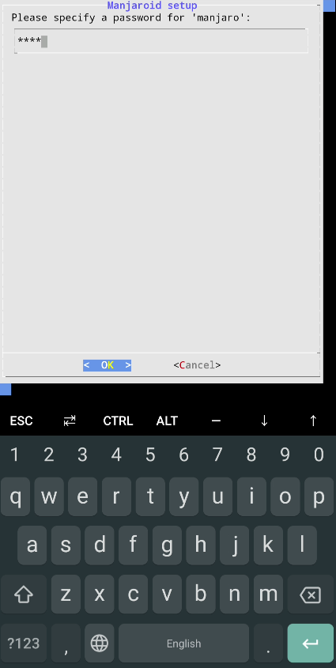</img>

10. Continue to install TigerVNC

</img>

11. Wait for setup to finish 

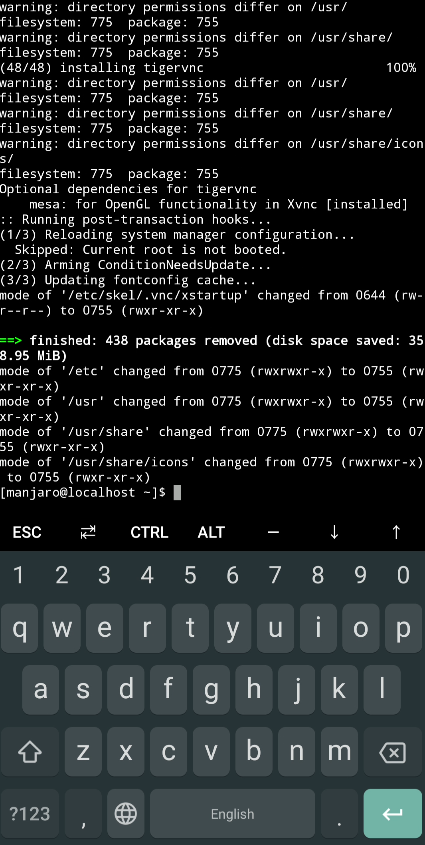</img>

12. Access it in VNC viewer android app. Run vncserver and ```Enter new password and confirm password``` at first run, inside manjaro terminal
```
vncserver
```
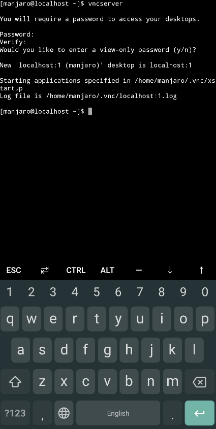</img>

13. Open RealVNC app and enter following
```
Address
localhost:1

Name
manjaro
```
Enter password for the user to access it.

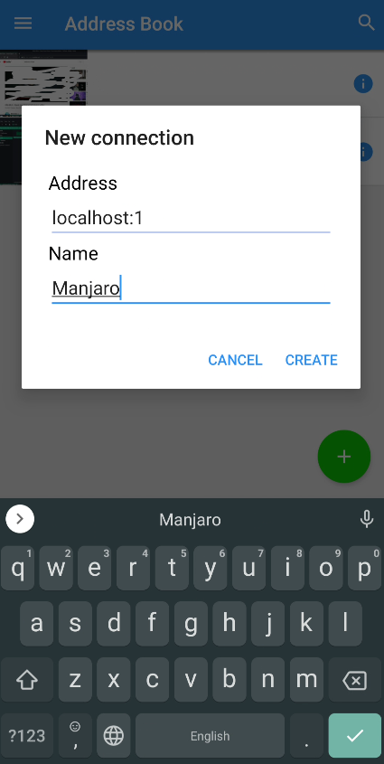</img>

# To run it after termux closed. 
1. Open termux
2. To run Manjaro 
```
./manjaro.sh
```
Select ```Chroot into existing rootfs```

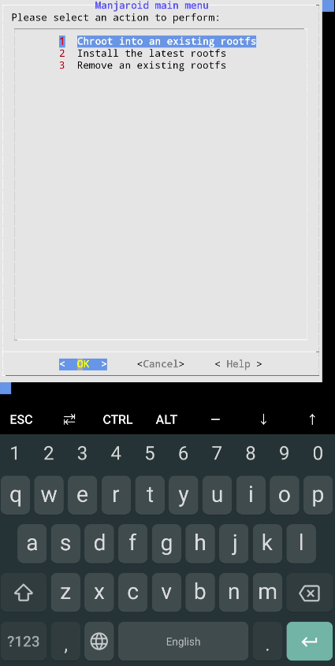</img>

3. May be ```vncserver``` not closed successfully, then re-run it.
```
vncserver -kill :1
```
Then
```
vncserver
```
4. Now open VNC viewer android app and type name and password and access it.

# Install Manjaro Demo

</img>

# Install Software
If Manjaro installed with desktop environment then continue.
## Anki
1. Run Manjaro
```
./manjaro.sh
``` 
2. Then in Manjaro, run following.
```
sudo pacman -S anki
```
It will install Anki 2.1.15-1

3. Type anki to run it
```
anki
```
Or by selecting it in desktop environment

### Demo

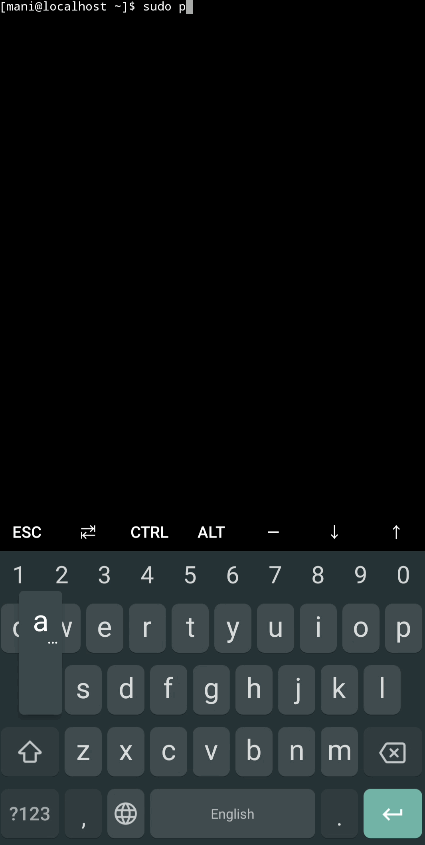</img>

# Some tips
1. Change ```Picture Quality``` to ```High``` in VNC viewer android app
2. Change to lower resolution inside ```Manjaro Display Settings``` for small screen devices
3. Uninstall unused programs from Manjaro to get more storage space
4. Hacker Keyboard from Play store can be used<br/>

**5. ```vncserver``` may be re-run to view it in vncviewer**<br/>
Inside Manjaro console
```
vncserver -kill :1
``` 
```
vncserver
```
Then open VNC viewer android app to access it.<br/>

**6. Add script to ```.bashrc``` to run script at startup.** 
<br/>Inside Manjaro terminal

```
cd ~
```

```
nano startup.sh
```
Add this to ```startup.sh```, To run anki at startup
```
anki
```
```CTRL + o``` and ```CTRL + x ``` to save and exit.

Add this to ```.bashrc```

```
nano .bashrc 
```
Add ``` ./startup.sh ``` the end of ```.bashrc``` file

Again, ```CTRL + o``` and ```CTRL + x``` to write and exit.

*But opening terminal in Manjaro will again run that script.*

# Faq?
### Black screen on VNC viewer?
There are many solutions for that. But in some cases reinstalling desktop environment may solve the problems.<br/>
For example: xfce4, run this to install xfce4.
```
sudo pacman -S xfce4 xfce4-goodies
```
# Credits
ItsMeKuroro<br>
[https://forum.manjaro.org](https://forum.manjaro.org/t/how-to-run-the-official-manjaro-arm-edition-on-android-with-chroot-environment/151429)
